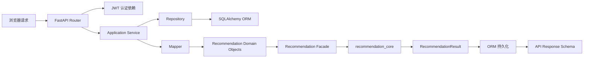
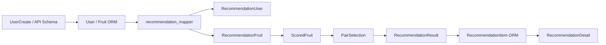

# 学习地图

## 学习目标

完成本章后，学习者能说出一次推荐请求经过哪些层，并知道每一层应该避免
承担什么职责。

## 前置知识

需要会读 Python 函数、dataclass、类型标注、基本 SQL `SELECT/JOIN`、HTTP
方法和 JSON。不会 SQLAlchemy 也没关系，本材料会从 `Session` 和 ORM 开始。

## 总体知识地图

这是当前项目的集成关系图，不表示每个请求都经过所有节点；例如已存在的当天
`active` 推荐会直接返回，不重新调用算法。

## 四个纵向案例

1. **首次获取今日推荐**：`GET /api/recommendations/today` →
   `get_today_recommendation` → Repository 批量加载 → Mapper → Facade →
   `recommendation_core` → `_persist_recommendation` → `RecommendationDetail`。
2. **换一组**：锁定同一用户，读取旧 `active` 的水果 ID，把 `excluded_pair`
   传给核心；成功才提交 `replaced` 和新 `active`，失败由事务回滚。
3. **提交反馈**：`item_id` 先解析到 Recommendation，再校验归属；相同
   `(item, user, type)` 已存在时幂等返回，否则新增一条 feedback 事件。
4. **算法选两种水果**：验证 → 硬过滤 → 归一化 → 单水果评分 → 枚举 pair →
   冷却分阶段放宽 → pair 评分 → seeded near-top 选择 → 理由。

## 对象演进

Schema 是 HTTP 合同，ORM 是数据库映射，领域对象是纯算法合同。它们字段相似，
但职责和生命周期不同。

## 容易迷失的跳转点

- `app.routers` 的函数不是评分入口；它只注入身份、Session 并调用 service。
- `recommendation_service.py` 是稳定 Facade，真正的过滤、评分和配对在
  `recommendation_core/`。
- `RecommendationItem.score` 是单水果分，而 `Recommendation.total_score` 是
  组合分；不要把它们当成同一个指标。
- `history_events` 是带日期的展示/食用历史，`feedback_events` 是用户反馈事件；
  两者都可能影响分数，但语义不同。
- `flush` 取得数据库 ID，不等于事务已经提交；`commit` 成功前仍可 rollback。

## 小练习

阅读 `backend/app/routers/recommendations.py`，写出“已有 active 推荐”和“没有
active 推荐”两条不同调用路径。建议不要修改生产代码。

## 本章事实来源

| 教学结论 | 源文件 | 符号 | 事实类型 |
| --- | --- | --- | --- |
| 路由调用 Application Service | `backend/app/routers/recommendations.py` | `get_today_recommendation` | 代码事实 |
| 领域对象由 Mapper 构造 | `backend/app/services/recommendation_mapper.py` | `user_to_recommendation_input` | 代码事实 |
| Facade 调用核心 | `backend/app/services/recommendation_service.py` | `recommend_fruits` | 代码事实 |
| 迁移按 revision 链演进 | `backend/alembic/versions/0001...0014` | `revision/down_revision` | migration 事实 |

## 本章总结

先掌握“请求经过哪些边界”，再学习每个边界内部的实现。后续章节都回到这张
地图，而不是把文件当成互不相关的代码片段。
