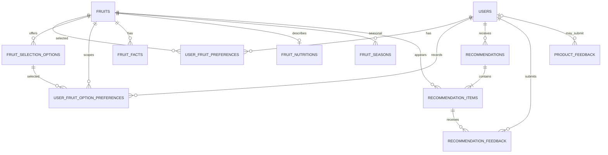

# 数据库模型

## 学习目标

能够从完整 migration 链推导当前 public schema，理解主键、外键、唯一约束、索引、
RLS 与 Python 校验的区别。

## 事实边界

当前仓库可由 `0001` 到 `0015` 的 `down_revision` 链推导最终结构：

```text
0001 → 0002 → … → 0011 → 0012 → 0013 → 0014 → 0015
```

`0001` 创建八张业务表；`0002` 加入 RLS 和权限收紧；`0003` 绑定 Supabase Auth；
`0004` 收紧 migration 表权限；`0005` 增加 V2 水果、熟悉度和推荐分字段；`0006`
增加消费周期；`0007` 增加购买条件；`0008`～`0010` 增加冷知识、展示语义与产品反馈；
`0011` 允许空偏好分；`0012` 增加消费子类型；`0013` 增加统一质地偏好、水果档案和
历史快照；`0014` 收紧离散偏好与尝试意愿状态；`0015` 把产地采收窗口与消费者
市场可得性拆成不同证据范围，并停用旧混合语义行。本文不声称远程数据库当前版本，除非另有现场
只读证据；这里的 schema 是仓库 migration 与 ORM 推导出的教学视图。

## 实体关系



## 表和约束

| 表 | 关键字段 | 约束/用途 |
| --- | --- | --- |
| `users` | `id` BIGINT identity、`auth_user_id` UUID、位置、口味、`discovery_level`、`consumption_horizon_days`、购买条件 | `auth_user_id` 唯一；口味/便利性 0～1；发现等级 0～2；消费周期 2/4/7；购买条件 1～3；推荐和反馈通过 `user_id` 关联 |
| `fruits` | `id`、`code`、`name`、类别、口感、价格、便利性、份量元数据、供应/角色字段、`is_active` | `name` 和 `code` 唯一；多个演示分数有 0～1 检查；inactive 由算法过滤 |
| `fruit_nutritions` | `fruit_id`、energy、vitamin C、fiber、potassium、folate、carotenoids | `fruit_id` 唯一并外键到 `fruits`；数值非负；当前 CSV 是无物理单位的 0～1 演示指数 |
| `fruit_seasons` | `fruit_id`、`data_scope`、region/level、start/end_month、season/availability、supply_status、证据质量/年份/说明、栽培类型、启用状态 | 月份 1～12；支持跨年；fruit/scope/region/month 组合唯一；启用行必须有中高质量证据；harvest 不声明市场供应，market 不声明采收季 |
| `fruit_facts` | fruit、类型、文案、顺序、active、来源说明 | 同一水果的 sort order 唯一；只作当天稳定展示，不参与推荐评分 |
| `user_fruit_preferences` | `user_id`、`fruit_id`、`preference_score`、`is_forbidden`、`has_tried`、`willing_to_try` | user/fruit 联合唯一；分数只能是 `-1/0/1/2` 或 `NULL`；意愿仅允许用于明确没吃过；用户删除时级联偏好 |
| `fruit_selection_options` | 父水果、类型 code/name、可空口感/质地/便利/保存覆盖、版本与展示顺序 | 13 条 seed；类型是父水果内档案，不是新的顶层候选 |
| `user_fruit_option_preferences` | user、fruit、option、preference | 记录类型层态度；唯一键防同一用户重复写同一类型 |
| `recommendations` | `user_id`、业务日期、`refresh_number`、`total_score`、status | status 为 `active/replaced`；同一用户同一天只有一个 active 的 partial unique index；用户删除受限 |
| `recommendation_items` | recommendation、fruit、score、individual/pair/nutrition 分、rank、JSONB `reasons` | recommendation 删除级联 item；同一推荐不能重复 fruit；rank 1/2；fruit 删除受限 |
| `recommendation_feedback` | item、user、feedback_type、comment | item 删除级联 feedback；user 删除受限；item/user/type 联合唯一实现幂等 |
| `product_feedback` | 可空 user、category、content、page、status、resolved_at | 与推荐反馈分表；用户删除时 SET NULL；状态与 resolved_at 必须一致 |

实际字段以 `backend/app/models/` 和完整 migration 为准；上表省略了时间戳等通用
列，不能替代 DDL。

## 生命周期和删除策略

正常推荐先是 `active`；点击换组时旧记录变成 `replaced`，新记录成为 `active`。
历史 item 和 feedback 不删除。Recommendation → Item → Feedback 是级联方向；
User/Fruit 对历史记录使用 RESTRICT，水果应通过 `is_active=false` 停用，而不是删除。

## 数据库约束与 Python 校验

Pydantic 在请求到达数据库前提供友好错误，例如 `UserUpdate` 的范围和枚举校验；
数据库 CHECK、FK、唯一约束是最后一道一致性边界，能保护绕过 API 的写入。两者不
互相替代：只写 Python 校验会留下并发或其它客户端的漏洞，只写数据库约束则难以
给 API 使用者友好反馈。

特别喜欢的跨层边界要分开说：Pydantic Schema 拒绝显式提交
`preference_score=2` 且 `has_tried=False`；Repository 在最终合并状态中把分数 `2`
推导为 `has_tried=True`。`0014` 数据库 CHECK 本身不包含 favorite → tried，它只保护
离散分数和 willingness 状态。因此不能把应用层推导误称为数据库约束。

## RLS 与权限

`0002` 对业务表启用 RLS，并撤销 `PUBLIC`、`anon`、`authenticated` 的直接表/序列
权限，且不创建宽泛 allow policy。当前浏览器不直接操作业务表，业务读写通过后端。
这是当前安全取舍；如果未来让 Supabase client 直接访问业务表，必须重新设计 policy。

## 可改进方向

当前 `fruit_nutritions` 的数值来源是演示数据，不应被解释成医学数据；购买条件和
消费周期目前保存但未进入推荐排序。任何新字段都应先修改 migration、ORM、schema、
mapper、算法合同和测试，而不是只在某一层添加列。

## 小练习

只读查看 `0001` 与 `0014`：找出 recommendation 的防重复约束，以及水果偏好新增的
两个 CHECK 分别保护什么。不要执行 migration。

## 本章事实来源

| 教学结论 | 源文件 | 符号/对象 | 事实类型 |
| --- | --- | --- | --- |
| 八张业务表和基础外键 | `backend/alembic/versions/0001_create_daily_fruit_tables.py` | `op.create_table` | migration 事实 |
| RLS/权限收紧 | `backend/alembic/versions/0002_secure_daily_fruit_tables.py` | `BUSINESS_TABLES`、`upgrade` | migration 事实 |
| Auth 绑定 | `backend/alembic/versions/0003_link_users_to_supabase_auth.py` | `auth_user_id` | migration 事实 |
| V2 字段 | `0005_recommendation_v2_data_model.py` | upgrade/downgrade | migration 事实 |
| 类型与历史快照 | `0012_fruit_selection_options.py`、`0013_texture_preference_and_fruit_profile.py` | upgrade/downgrade | migration 事实 |
| 离散偏好与意愿状态 | `0014_enforce_discrete_fruit_preferences.py` | precheck、CHECK | migration 事实 |
| 用户字段含义 | `backend/app/models/user.py`、`backend/app/schemas/user.py` | `User`、`UserBase` | 代码事实 |
| ORM 元数据回归 | `backend/tests/test_model_metadata.py` | metadata tests | 测试事实 |

## 本章总结

数据库模型不是“类的集合”，而是字段、约束、索引、权限和删除行为的整体合同。
教学时应同时阅读 migration 和 ORM，不能只看最新 migration 或只看 Python class。
