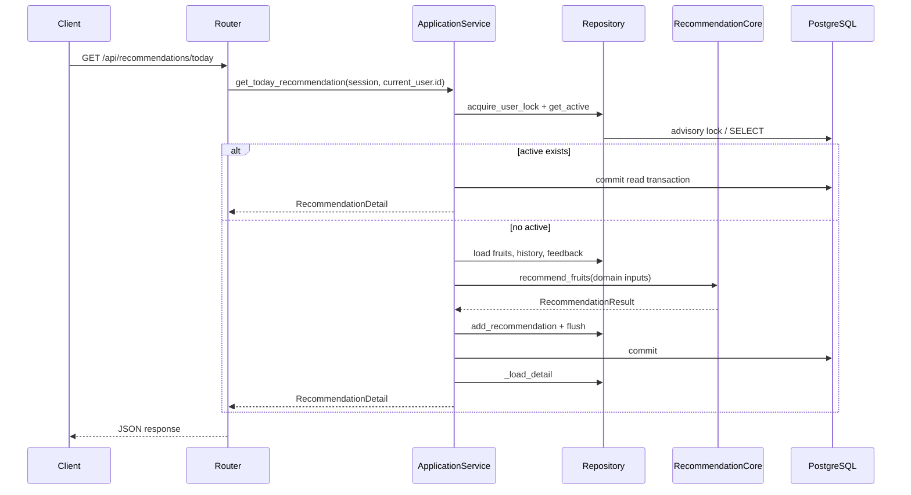

# Application Service 与事务

## 学习目标

理解首次推荐、换组和反馈的事务边界，解释用户级锁、`flush`、`commit`、`rollback`
以及 active/replaced 生命周期。

## 业务问题

“换一组”不是只重新调用一个函数：旧推荐要变成历史，新推荐要保存两条 item，
旧组合必须排除，而且并发请求不能同时产生两个 active。Application Service 负责把
这些步骤放在同一个业务事务中。

## 真实入口

`backend/app/services/recommendation_application_service.py` 的主要入口是：

- `get_today_recommendation`：有当天 active 就复用，否则创建；
- `refresh_recommendation`：旧 active → replaced，再创建新 active；
- `submit_feedback`：校验 item 归属，幂等写入 feedback；
- `_calculate_recommendation`：加载数据库快照并调用 Facade；
- `_persist_recommendation`：把 `RecommendationResult` 映射成 ORM 图；
- `_load_detail`：提交后重新 eager-load，转换 API response。

## 首次获取时序

## 换组事务

1. `acquire_user_lock` 先锁定用户级临界区；
2. `get_active_recommendation(..., for_update=True)` 读取当天 active；
3. 收集 `previous_ids`，把旧状态改为 `replaced` 并 `session.flush()`；
4. 计算新的 `refresh_number`，在 `RecommendationContext.excluded_pair` 中传入旧组合；
5. 核心返回不同组合后，`_persist_recommendation` 添加新主表和两个 item；
6. 只有全部成功才 `commit`；否则 Session 依赖或上层错误处理 `rollback`，旧 active
   的 replaced 修改和新对象都不会留下。

`excluded_pair` 是算法硬约束，不能通过删除某个水果、改变候选库再偷偷重算来绕过。
如果只有旧组合可行，核心应抛出领域错误，应用层把它转换成资源冲突。

## 锁与唯一约束的区别

- advisory lock：在事务内串行化“检查 active → 计算 refresh_number → 插入”的流程；
- `uq_recommendations_active_user_date` partial unique index：数据库最后阻止同一用户同
  一天出现两个 active。

锁解决流程竞争，唯一索引保护最终数据状态；它们不是互相替代。

## 反馈链路

`submit_feedback` 先通过 `get_item` 找到 item 和所属 recommendation，再比较
`expected_user_id`。相同 `(recommendation_item_id, user_id, feedback_type)` 存在时返回
`created=False`；否则 `add_feedback` 后 commit。feedback 是事件，算法可读取带时间的
`feedback_events`，没有事件时也有聚合 fallback。`change_requested` 是换组事件，不能
自动当成某种水果的长期 dislike。

## 容易混淆的地方

- `flush` 不是 `commit`；刷新失败时 flush 过的 replaced 仍可 rollback。
- 推荐历史保留 replaced 记录；active 不是“唯一一条推荐”，而是当前生命周期状态。
- `previous_pairs` 用于长期新颖度，`cooldown_pairs` 用于短期完整组合冷却，
  `excluded_pair` 只针对本次换组并且永不放宽。

## 小练习

在 `backend/tests/test_recommendation_application_invariants.py` 中找到“应用层不重试”
和“不变式检查”的测试。说明如果 `_calculate_recommendation` 抛错，哪一个对象必须
仍为 active，以及为什么测试不应该只检查 HTTP 状态码。

## 本章事实来源

| 教学结论 | 源文件 | 符号 | 事实类型 |
| --- | --- | --- | --- |
| 首次/刷新事务编排 | `backend/app/services/recommendation_application_service.py` | 两个 public service | 代码事实 |
| 旧组合硬排除 | 同上 | `_calculate_recommendation` | 代码事实 |
| 用户级锁 | `backend/app/repositories/recommendation_repository.py` | `acquire_user_lock` | 代码事实 |
| active 唯一性 | `backend/alembic/versions/0001_create_daily_fruit_tables.py` | partial unique index | migration 事实 |
| 回滚不变式 | `backend/tests/test_recommendation_application_invariants.py` | test functions | 测试事实 |

## 本章总结

Application Service 的价值在于把多个 Repository 调用、纯算法调用和事务状态组成
一个可验证的业务操作；它不应该成为第二份推荐算法。
