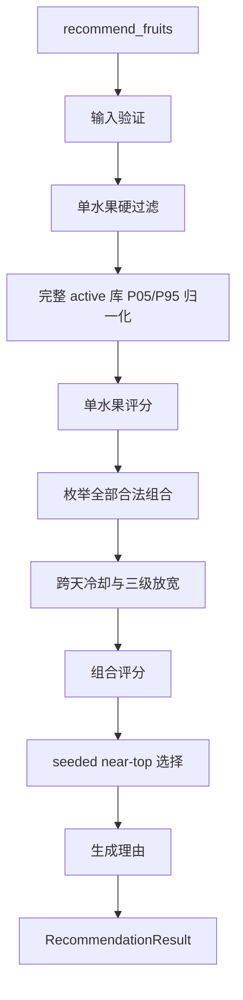

# 推荐引擎

## 学习目标

能从 Facade 进入 `recommendation_core`，区分硬约束与软评分、单水果分与组合分，
并解释历史、反馈、冷却和 deterministic seed 的作用。

## 真实模块边界

`backend/app/services/recommendation_service.py` 是稳定公开门面，显式重导出公开
符号并组装 `RecommendationResult`。内部模块是：

- `recommendation_core/common.py`：领域异常、`clamp_score`、单位区间校验；
- `fruit_evaluation.py`：季节、营养、候选过滤、单水果评分、历史反馈衰减；
- `pair_selection.py`：营养互补、组合合法性、冷却阶段和 pair 选择；
- `reasons.py`：依据真实贡献生成 2～4 条理由。

核心模块不访问 Repository、Session、FastAPI 或 SQLAlchemy。

## 输入与输出类型

- `RecommendationUser`：位置、口味、价格、便利性、`discovery_level` 和水果偏好；
- `RecommendationFruit`：水果身份、口感、价格、便利性、营养和季节快照；
- `ScoredFruit`：一个水果及 `ScoreBreakdown`；
- `PairSelection`：两个 `ScoredFruit`、pair score、互补/感官/新颖度分；
- `RecommendationItemResult`：一个展示 item 及理由；
- `RecommendationResult`：恰好两个 item 和组合 `total_score`。

## 实际执行顺序



## 硬约束与软评分

硬约束直接移除候选或组合：inactive、forbidden、`willing_to_try=False`、明确
不可用供应、保守模式下未尝试水果、`excluded_pair` 和当前冷却阶段规则。软评分
不会直接禁止水果，而是改变排序：季节、口味、显式偏好、便利性、价格、历史和反馈。

`has_tried=None` 是未知，不能当作 `False`；`has_tried=False` 才表示明确没吃过。
购买条件 `market_access_level`、`accepts_online_purchase` 和
`consumption_horizon_days` 目前由保存链路保留，但 `recommendation_mapper` 不把它们
放入 `RecommendationUser`，所以当前不参与推荐。

## 当前单水果公式

当前 `BASE_SCORE_WEIGHTS` 为：

```text
base = 0.30 * explicit_preference
      + 0.25 * taste_match
      + 0.20 * availability_and_season
      + 0.10 * price_match_score
      + 0.10 * convenience_score
      + 0.05 * history_diversity_score
      + feedback_adjustment
```

结果通过 `clamp_score` 限制在 0～1。反馈和历史分别使用当前代码中的事件类型、
衰减天数和指数参数；它们是人工启发式参数，不是概率、准确率或行业标准。

营养数据是 0～1 的无物理单位演示指数，使用完整 active 水果库的 P05/P95 归一化；
`default_portion_grams` 当前不参与营养计算。

## 当前组合公式

`PAIR_SCORE_WEIGHTS` 为：

```text
pair = 0.70 * mean(first.base_score, second.base_score)
     + 0.15 * nutrition_pair
     + 0.10 * sensory_category_diversity
     + 0.05 * pair_novelty
```

组合使用 `combinations(scored, 2)` 完整枚举，而不是只取单水果排名前二。冷却按
“尽量避开近期单水果 → 保留完整组合冷却 → 必要时放开完整组合冷却”逐级放宽；
`excluded_pair` 永远不放宽。带 `random_seed` 时只在最高分附近的 near-top 列表中
使用 `random.Random(seed).choice`，因此相同输入可复现。

## 推荐理由

`reasons._build_reasons` 读取单水果和组合评分的真实贡献，按绝对贡献排序，最多四条，
保留正向反馈理由，并在不足时补足至少两条。理由是解释当前启发式分数的 UI 文本，
不是医疗诊断、营养缺乏判断或治疗承诺。

## 容易混淆的地方

- `previous_pairs` 是历史新颖度输入，`cooldown_pairs` 是短期硬冷却输入；
- `recent_fruit_ids` 是兼容旧输入，带日期的 `history_events` 更具体；
- `score_candidates` 公开返回单水果排序，`select_recommendation_pair` 还要执行组合；
- Facade 不是算法逻辑的第二份实现，只负责导出和组装。

## 小练习

阅读 `fruit_evaluation.filter_eligible_fruits` 和 `pair_selection._pair_is_legal`，
把每条规则分成硬约束/软评分。再用三个水果手算组合公式，说明为什么基础分第二名
不一定成为第二个展示水果。

## 本章事实来源

| 教学结论 | 源文件 | 符号 | 事实类型 |
| --- | --- | --- | --- |
| 单水果权重 | `backend/app/services/recommendation_core/fruit_evaluation.py` | `BASE_SCORE_WEIGHTS` | 代码事实 |
| 组合权重/冷却 | `backend/app/services/recommendation_core/pair_selection.py` | `PAIR_SCORE_WEIGHTS`、`select_recommendation_pair` | 代码事实 |
| 领域对象字段 | `backend/app/services/recommendation_types.py` | dataclass definitions | 代码事实 |
| 理由贡献 | `backend/app/services/recommendation_core/reasons.py` | `_build_reasons` | 代码事实 |
| 规则回归 | `backend/tests/services/` | filtering/pair/reasons tests | 测试事实 |

## 本章总结

这是一个白盒规则系统，不是训练完成的机器学习模型。学习重点是把输入语义、硬
约束、可解释评分和组合选择连接起来，并能指出哪些字段目前还没有进入算法。`n