# Alembic Migration

## 学习目标

理解 ORM 变化与数据库变化的区别，能读取 `revision/down_revision` 链，知道
`upgrade`、`downgrade` 的责任和为什么不能用手工 SQL 代替 migration 记录。

## ORM 不是数据库历史

SQLAlchemy model 描述“现在希望如何映射”；Alembic migration 描述“数据库如何从
旧版本演进到新版本”。删除 ORM 字段不会自动删除远程列，修改 migration 文件也不
会回放已经执行的历史。因此 schema 变更要同时审查 model、migration、schema、seed
和测试。

## 当前 revision 链

```mermaid
flowchart LR
    m1[0001 基础业务表] --> m2[0002 RLS 与权限]
    m2 --> m3[0003 Auth 绑定]
    m3 --> m4[0004 migration 表权限]
    m4 --> m5[0005 推荐 V2 字段]
    m5 --> m6[0006 消费周期]
    m6 --> m7[0007 购买条件]
    m7 --> m8[0008-0010 内容与展示]
    m8 --> m11[0011 可空偏好]
    m11 --> m12[0012 消费子类型]
    m12 --> m13[0013 质地与快照]
    m13 --> m14[0014 离散偏好状态]
    m14 --> m15[0015 季节与市场证据分离]
```



这里的编号是仓库当前事实，不应写成未来永久规则。检查 head 时应读取
`backend/alembic/versions/` 中全部文件或运行安全的 `alembic history`；不能只看
最新文件的 `down_revision`。

## 三个演进案例

1. `0001_create_daily_fruit_tables.py` 创建八张 public 业务表、主键、外键、检查、
   索引和 recommendation active partial unique index。
2. `0005_recommendation_v2_data_model.py` 增加水果身份/供应/熟悉度、用户
   `discovery_level`、偏好熟悉度和推荐 item 的拆分分数；downgrade 先检查数据是否
   会丢失，再移除列。
3. `0007_user_market_access.py` 只增加 `market_access_level` 与
   `accepts_online_purchase`，并明确注释“当前只进入资料保存链路”。
4. `0012`/`0013` 建立父水果内消费类型、统一质地偏好与历史快照；这些属于跨表、
   兼容和历史语义变化，不能只看新增列。
5. `0014_enforce_discrete_fruit_preferences.py` 先只读统计不合法历史行；若发现分数不在
   `-1/0/1/2`，或意愿出现在非“明确没吃过”记录上，就在 DDL 前停止，不猜测如何改数据。
6. `0015_season_availability_evidence.py` 保留旧行但标记为停用 `legacy`，新增证据范围、
   质量、来源年份与评分开关；downgrade 在不同 scope 会合并成同一旧自然键时主动停止。

`0002` 和 `0004` 主要是安全/权限操作，不应被误画成普通字段 migration。

## upgrade 与 downgrade

`upgrade` 应在目标环境确认后按链执行，`downgrade` 应只删除该 revision 拥有的对象。
生产 downgrade 具有破坏性，通常只在可丢弃测试数据库演练。当前迁移中的某些安全
回滚刻意不重新开放浏览器权限，这是安全取舍，不是“每一步都完全反向”。

## 检查流程

```text
读取所有 revision/down_revision
→ 推导最终表、列、约束、索引
→ 对照 ORM metadata 和静态测试
→ 在隔离数据库执行 upgrade/downgrade（若获授权）
```

本教材只做源码和静态事实导读，不执行远程 migration。仓库的集成 migration 测试在
配置安全本地测试库时才运行；没有安全测试库时应如实跳过。

## 常见错误修改

- 直接在 Supabase Dashboard 加列却不生成 Alembic revision；
- 修改已经发布的旧 migration 期待远程自动同步；
- downgrade 误删其他 revision 创建的约束；
- 把 auth/storage 系统 schema 当作本项目业务表迁移。

## 小练习

用文本读取 `0011`～`0015` 的 `down_revision`，画出偏好、类型、质地、历史快照与季节
证据合同的变化。指出 `0014` 为什么先 precheck 再改 CHECK，以及 `0015` 为什么不能
把 harvest 当成用户所在地区的市场库存。不要执行 `upgrade`。

## 本章事实来源

| 教学结论 | 源文件 | 符号/文件 | 事实类型 |
| --- | --- | --- | --- |
| revision 链 | `backend/alembic/versions/0001...0015` | `revision`、`down_revision` | migration 事实 |
| 基础 schema | `0001_create_daily_fruit_tables.py` | `upgrade` | migration 事实 |
| RLS 与权限 | `0002_secure_daily_fruit_tables.py` | `upgrade/downgrade` | migration 事实 |
| 可丢失数据保护 | `0005_recommendation_v2_data_model.py` | `downgrade` | migration 事实 |
| 当前偏好约束 | `0014_enforce_discrete_fruit_preferences.py` | `_count_invalid_rows`、`upgrade` | migration 事实 |
| 季节与市场证据 | `0015_season_availability_evidence.py` | `upgrade`、`downgrade` | migration 事实 |
| 静态一致性测试 | `backend/tests/test_migration_static.py` | test functions | 测试事实 |

## 本章总结

Migration 是数据库演进的可审计历史。任何结构变化都必须同时思考现有数据、回滚
风险、ORM 合同和测试隔离。
