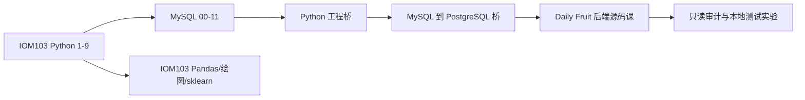

# IOM103、SQL 与 Daily Fruit 衔接路线

## 审计结论

三套材料可以衔接，但不能直接从 IOM103 的基础练习跳到 Daily Fruit 推荐后端。
IOM103 提供 Python、Pandas、绘图和机器学习基础；桌面 SQL 主课程提供 MySQL 查询、
JOIN、聚合、CTE 与安全事务；Daily Fruit 还要求类型合同、pytest 工程测试、HTTP/API、
Pydantic、SQLAlchemy、PostgreSQL 和 Alembic。缺口由本目录的两章桥接材料补齐。

主线使用以下真实目录：

- `C:\Users\12086\Desktop\IOM103_Python_Data_Analysis`
- `C:\Users\12086\Desktop\SQL学习材料\mysql_beginner_practice`
- 当前仓库 `docs/backend-course`

`C:\Users\12086\Desktop\SQL学习材料\sql_beginner_practice` 是旧 SQL Server/T-SQL
课程，只用于比较 `TOP`、`USE` 等方言，不与 MySQL 主线同时学习。

## 当前可验证状态

- IOM103 全量测试为 `161 passed, 147 xfailed`；四个领域分别为
  `36/42/18/45 passed` 和同数 xfailed。参考答案与课程完整性正常，但 147 个个人
  practice 仍保留 TODO，不能据此说学习者已经掌握。
- MySQL `progress_tracker.md` 尚未勾选，独立测评也没有个人作答，能力尚未验证。
- MariaDB 客户端仍存在，但本次只读连接返回 `ERROR 2002`，服务当前未监听；旧审计中
  的 MariaDB 10.4.32 实跑是历史证据，不代表现在已经启动。
- Daily Fruit 教材已按当前代码、migration 与测试合同重新核对；但教材核对、测试通过
  与个人能独立解释或实现仍是三个不同结论。

## 推荐主线

如果目标是尽快读懂 Daily Fruit 后端，不必先完成 Pandas、Matplotlib 和 sklearn。
先完成 Python 9 章和 SQL 主线；数据分析四个领域的其余内容可以并行或在后端主线后
继续。推荐算法是规则系统，不需要先学完机器学习。

## 文件顺序

1. 本页：确认路线和边界；
2. [Python 工程桥](01-python-engineering-bridge.md)；
3. [MySQL 到 PostgreSQL 桥](02-mysql-to-postgresql-bridge.md)；
4. [阶段计划](03-study-plan.md)；
5. [验收门槛](04-readiness-gates.md)；
6. `docs/backend-course/README.md`。

本目录练习只给任务和验收条件，不提供答案。不要修改外部 IOM103/SQL 仓库的答案、
测试或进度来制造“完成”；实际完成后应由原测试、独立 SQL 作答和口头解释共同证明。
