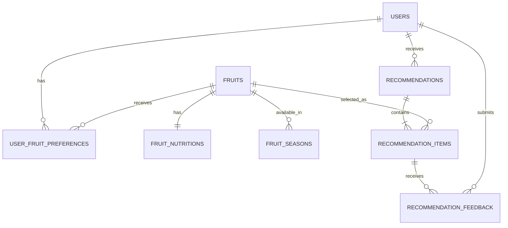

# 阶段一：现状、架构与实施计划

## 1. 当前状态与冲突风险

- 工作区目标路径：`大二/daily-fruit`，检查时不存在同名目录。
- `大二` 下已有多个独立课程和项目；现有 Supabase 相关代码位于 `SURF`，不属于本项目。
- 未发现可复用的 Alembic 配置。
- 已连接的 Supabase 工具当前返回 0 个可访问项目，因此无法确认任何远端 `public` 表、字段、约束、索引、迁移、RLS 策略或数据。
- 本阶段数据库写入为 0。必须先恢复项目可见性并重新完成只读审计，之后才能生成或执行 Alembic 迁移。

主要风险：

1. 未知远端项目可能已有同名业务表，后续迁移必须按实际结构逐项兼容。
2. `public` 默认可能暴露给 Data API；即使前端不直连，也必须审查 grants 与 RLS。
3. `users` 是常见表名，可能与已有业务模型冲突；不得仅按名称判断兼容。
4. 正式认证尚未实现，固定测试用户只能用于本地演示。
5. 迁移运行与应用运行可能需要不同连接方式；IPv4 环境优先评估 Supabase Session Pooler。

## 2. 目标目录结构

```text
daily-fruit/
├── frontend/
│   ├── src/
│   │   ├── api/
│   │   │   ├── client.js
│   │   │   ├── user.js
│   │   │   ├── fruit.js
│   │   │   └── recommendation.js
│   │   ├── components/
│   │   │   ├── FruitCard.vue
│   │   │   ├── NutritionTags.vue
│   │   │   ├── RecommendationReasons.vue
│   │   │   └── FeedbackButtons.vue
│   │   ├── views/
│   │   │   ├── OnboardingView.vue
│   │   │   ├── TodayView.vue
│   │   │   ├── PreferencesView.vue
│   │   │   └── HistoryView.vue
│   │   ├── router/index.js
│   │   ├── assets/
│   │   ├── App.vue
│   │   └── main.js
│   ├── package.json
│   └── vite.config.js
├── backend/
│   ├── app/
│   │   ├── models/
│   │   ├── schemas/
│   │   ├── routers/
│   │   ├── repositories/
│   │   ├── services/
│   │   ├── seed/
│   │   ├── config.py
│   │   ├── database.py
│   │   └── main.py
│   ├── alembic/
│   ├── tests/
│   ├── alembic.ini
│   ├── requirements.txt
│   └── .env.example
├── data/
│   ├── fruits_seed.json
│   ├── nutrition_demo.csv
│   └── seasons_demo.csv
├── docs/stage-1-plan.md
├── README.md
└── .gitignore
```

阶段一只创建其中的启动必需文件，其余目录在对应阶段按需创建。

## 3. 数据库 ER 关系



计划删除行为：

- `recommendations -> recommendation_items`：`ON DELETE CASCADE`；
- `recommendation_items -> recommendation_feedback`：`ON DELETE CASCADE`；
- 用户、水果与历史记录：默认 `RESTRICT` 或 `NO ACTION`，水果使用 `is_active=false` 软停用；
- 所有外键列建立索引；联合唯一约束按需求单独建立。

## 4. API 设计

| 方法 | 路径 | 用途 |
|---|---|---|
| GET | `/health` | 服务状态；可选安全检查数据库 |
| POST | `/api/users` | 创建演示用户 |
| GET | `/api/users/{user_id}` | 获取用户 |
| PUT | `/api/users/{user_id}` | 更新用户 |
| GET | `/api/users/{user_id}/fruit-preferences` | 获取水果偏好 |
| PUT | `/api/users/{user_id}/fruit-preferences` | 批量保存偏好 |
| GET | `/api/fruits` | 获取可用水果 |
| GET | `/api/fruits/{fruit_id}` | 获取水果详情 |
| GET | `/api/recommendations/today?user_id=1` | 获取或首次生成当日 active 推荐 |
| POST | `/api/recommendations/refresh` | 替换当日推荐并记录换一组事件 |
| GET | `/api/users/{user_id}/recommendations` | 获取推荐历史 |
| POST | `/api/recommendations/items/{item_id}/feedback` | 提交反馈 |

## 5. 推荐算法伪代码

```text
function recommend(user, fruits, month, region, history, feedback, random_seed):
    rng = seeded_random(random_seed)
    candidates = []

    for fruit in fruits:
        if not fruit.is_active:
            continue
        preference = preference_for(user, fruit)
        if preference.is_forbidden:
            continue
        if policy_excludes_explicit_dislike(preference):
            continue

        season = normalized_season_score(fruit, region, month)
        if season.is_known_and_completely_inapplicable:
            continue

        scores = {
            season: season.value_or_penalty,
            preference: normalized_preference(preference),
            nutrition_diversity: normalized_nutrition_diversity(fruit),
            history_diversity: history_score(fruit, history),
            convenience: normalized_convenience_match(fruit, user),
            price_match: normalized_price_match(fruit, user)
        }

        base_score =
            scores.season * 0.35 +
            scores.preference * 0.25 +
            scores.nutrition_diversity * 0.20 +
            scores.history_diversity * 0.10 +
            scores.convenience * 0.05 +
            scores.price_match * 0.05

        candidates.append(fruit, scores, base_score)

    if candidates has fewer than 2 fruits:
        raise understandable_no_candidate_error

    first = seeded_choice_from_near_top_candidates(candidates, rng)

    for candidate in candidates excluding first:
        complement = normalized_nutrition_complement(first, candidate)
        candidate.second_score = candidate.base_score * 0.7 + complement * 0.3

    second = highest_second_score_avoiding_recent_same_pair(candidates)
    reasons = reasons_derived_from_actual_subscores(first, second)
    return first, second, reasons
```

所有权重集中定义；营养特征先逐维归一化；理由只引用实际参与评分的因素。

## 6. 分阶段实施计划

1. **阶段一：检查与骨架**  
   完成本地盘点、远端只读审计、架构文档、最小 Vue/FastAPI 启动验证。
2. **阶段二：项目骨架完善**  
   加入 Router、Service、Repository 空边界，稳定配置、CORS、统一错误响应和数据库连接生命周期。
3. **阶段三：模型与迁移**  
   恢复 Supabase 项目可见性后重新盘点；建立 ORM 与 Alembic；审阅生成 SQL；最小迁移；反向验证结构、grants、RLS、索引和 advisors；幂等 seed。
4. **阶段四：纯 Python 推荐算法**  
   使用内存对象完成过滤、评分、互补、理由和 random seed 测试，不依赖 API。
5. **阶段五：后端 API**  
   Repository 管查询，Service 管事务与算法，Router 仅处理 HTTP；完成 TestClient 与数据库错误测试。
6. **阶段六：Vue 页面**  
   加入路由、统一 fetch、四个页面、移动端样式、状态与重复提交保护。
7. **阶段七：最终审查**  
   执行 pytest、前端构建、Alembic current/history、Supabase 结构/安全/数据/孤立记录检查和秘密扫描。

## 7. 数据库修改前置门

后续任何 DDL 或 seed 前必须全部满足：

1. Supabase 工具能列出目标项目，且用户确认目标项目；
2. 导出 `public` 表、列、约束、索引、外键删除行为、RLS、策略和 grants；
3. 列出 Supabase 迁移历史及 Alembic 当前版本；
4. 检查 8 个候选表名是否冲突并抽样确认已有数据；
5. 生成向前迁移和可审查的降级策略；
6. 确认不触碰 `auth`、`storage` 等系统 schema；
7. 迁移后重新读取实际结构并运行安全与性能 advisors。

