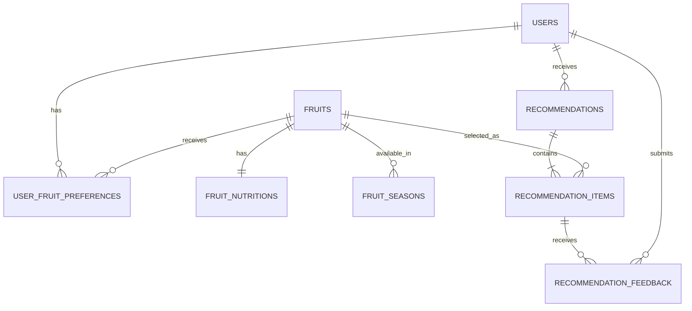
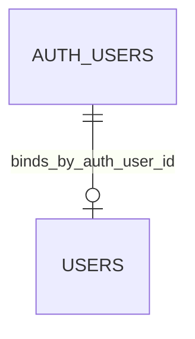

# 阶段二：数据库目标设计

状态：**设计完成，实施被 Supabase 项目身份门禁阻塞。**  
本文是目标模型，不是已经存在的远端结构。远端只读审计完成后，必须逐表对照并修订，禁止直接照文档执行 DDL。

## 1. 关键架构决策

### 1.1 `users` 主键

第一版采用 `BIGINT GENERATED BY DEFAULT AS IDENTITY` 主键。

理由：

- 第一版没有登录，API 和测试可稳定使用简单整数 ID；
- 不把应用用户主键直接等同于 `auth.users.id`；
- 后续接入 Supabase Auth 时，通过独立迁移增加：

```text
users.auth_user_id UUID NULL UNIQUE
  REFERENCES auth.users(id) ON DELETE SET NULL
```

完成账号绑定后，RLS 使用 `auth.uid() = users.auth_user_id`。现有 BIGINT 业务外键保持不变，不需要重写历史记录。

### 1.2 Schema

八张业务表统一放在 `public`：

- 便于 SQLAlchemy、Alembic 和 Supabase 工具审计；
- 符合当前项目约定；
- 不修改 `auth`、`storage` 等系统 schema。

因为 `public` 可能暴露给 Data API，必须显式审计和管理 grants/RLS，不能依赖项目默认设置。

### 1.3 时间

- 事件时间统一使用 `TIMESTAMPTZ`；
- `recommendation_date` 使用 `DATE`；
- 应用层用 UTC 保存时间，展示时按用户地区转换；
- `updated_at` 由 Service 在更新时显式写入，数据库提供 `DEFAULT now()`；
- 第一版不创建通用更新时间触发器，避免隐藏副作用。

### 1.4 JSONB

`recommendation_items.reasons` 使用 JSONB，固定为数组：

```json
[
  {
    "code": "in_season",
    "message": "当前处于适宜购买月份",
    "component": "season_score"
  }
]
```

规则：

- 数据库检查 `jsonb_typeof(reasons) = 'array'`；
- Pydantic 验证每项字段；
- 每种水果保存 2 到 4 条理由；
- JSON 序列化使用稳定字段名和顺序；
- 第一版不建立 GIN 索引，因为没有按理由内容检索的需求。

## 2. ER 关系



未来 Auth 关系：



## 3. 表设计

所有标识符使用小写 snake_case。

### 3.1 `users`

| 字段 | 类型 | 约束 |
|---|---|---|
| `id` | `BIGINT` | identity，主键 |
| `username` | `VARCHAR(80)` | 非空 |
| `city` | `VARCHAR(100)` | 非空 |
| `region` | `VARCHAR(100)` | 非空 |
| `sweet_preference` | `NUMERIC(4,3)` | 非空，0 到 1 |
| `sour_preference` | `NUMERIC(4,3)` | 非空，0 到 1 |
| `soft_preference` | `NUMERIC(4,3)` | 非空，0 到 1 |
| `crisp_preference` | `NUMERIC(4,3)` | 非空，0 到 1 |
| `price_level` | `SMALLINT` | 非空，1 到 3 |
| `convenience_preference` | `NUMERIC(4,3)` | 非空，0 到 1 |
| `created_at` | `TIMESTAMPTZ` | 非空，默认 `now()` |
| `updated_at` | `TIMESTAMPTZ` | 非空，默认 `now()` |

初始值由 API Schema 明确提供或使用可审查默认值。`username` 是显示名称，不作为认证凭据。

未来迁移增加 `auth_user_id UUID NULL UNIQUE`，阶段二初始迁移不提前引用 `auth.users`。

### 3.2 `fruits`

| 字段 | 类型 | 约束 |
|---|---|---|
| `id` | `BIGINT` | identity，主键 |
| `name` | `VARCHAR(100)` | 非空，唯一 |
| `category` | `VARCHAR(80)` | 非空 |
| `taste` | `VARCHAR(120)` | 非空，人类可读标签 |
| `sweet_score` | `NUMERIC(4,3)` | 非空，0 到 1 |
| `sour_score` | `NUMERIC(4,3)` | 非空，0 到 1 |
| `soft_score` | `NUMERIC(4,3)` | 非空，0 到 1 |
| `crisp_score` | `NUMERIC(4,3)` | 非空，0 到 1 |
| `convenience_score` | `NUMERIC(4,3)` | 非空，0 到 1 |
| `average_price_level` | `SMALLINT` | 非空，1 到 3 |
| `default_portion` | `VARCHAR(80)` | 非空 |
| `image_url` | `TEXT` | 可空 |
| `description` | `TEXT` | 非空 |
| `is_active` | `BOOLEAN` | 非空，默认 `true` |
| `created_at` | `TIMESTAMPTZ` | 非空，默认 `now()` |
| `updated_at` | `TIMESTAMPTZ` | 非空，默认 `now()` |

增加四个味觉/质地分数是为了让甜、酸、软、脆匹配可计算且可校验；`taste` 只用于展示，不承担算法数据结构职责。

索引：

- `UNIQUE (name)`；
- 部分索引 `WHERE is_active = true`，是否保留由真实数据量和查询计划决定。

### 3.3 `fruit_nutritions`

| 字段 | 类型 | 约束 |
|---|---|---|
| `id` | `BIGINT` | identity，主键 |
| `fruit_id` | `BIGINT` | 非空，唯一，外键 |
| `energy` | `NUMERIC(10,2)` | 非空，>= 0 |
| `vitamin_c` | `NUMERIC(10,2)` | 非空，>= 0 |
| `fiber` | `NUMERIC(10,2)` | 非空，>= 0 |
| `potassium` | `NUMERIC(10,2)` | 非空，>= 0 |
| `folate` | `NUMERIC(10,2)` | 非空，>= 0 |
| `carotenoids` | `NUMERIC(10,2)` | 非空，>= 0 |
| `created_at` | `TIMESTAMPTZ` | 非空，默认 `now()` |
| `updated_at` | `TIMESTAMPTZ` | 非空，默认 `now()` |

外键：

```text
fruit_id -> fruits.id ON DELETE CASCADE
```

营养值按每 100 克存储。演示归一化分数与真实单位数据不得混在同一批数据中；最终 seed 必须统一一种口径并在 README 标注。

### 3.4 `fruit_seasons`

| 字段 | 类型 | 约束 |
|---|---|---|
| `id` | `BIGINT` | identity，主键 |
| `fruit_id` | `BIGINT` | 非空，外键 |
| `region` | `VARCHAR(100)` | 非空 |
| `start_month` | `SMALLINT` | 非空，1 到 12 |
| `end_month` | `SMALLINT` | 非空，1 到 12 |
| `season_score` | `NUMERIC(4,3)` | 非空，0 到 1 |
| `created_at` | `TIMESTAMPTZ` | 非空，默认 `now()` |

约束：

- `fruit_id -> fruits.id ON DELETE CASCADE`；
- `UNIQUE (fruit_id, region, start_month, end_month)`。

索引：

- `(region, fruit_id)`，支持按地区取候选季节数据。

跨年月份由 Service 处理：

```text
start <= end: start <= month <= end
start > end: month >= start OR month <= end
```

### 3.5 `user_fruit_preferences`

| 字段 | 类型 | 约束 |
|---|---|---|
| `id` | `BIGINT` | identity，主键 |
| `user_id` | `BIGINT` | 非空，外键 |
| `fruit_id` | `BIGINT` | 非空，外键 |
| `preference_score` | `NUMERIC(4,2)` | 非空，-1 到 2，默认 0 |
| `is_forbidden` | `BOOLEAN` | 非空，默认 `false` |
| `created_at` | `TIMESTAMPTZ` | 非空，默认 `now()` |
| `updated_at` | `TIMESTAMPTZ` | 非空，默认 `now()` |

约束：

- `user_id -> users.id ON DELETE CASCADE`；
- `fruit_id -> fruits.id ON DELETE RESTRICT`；
- `UNIQUE (user_id, fruit_id)`。

索引：

- 联合唯一索引支持用户偏好查询；
- 单独索引 `fruit_id`，支持反向外键检查和维护。

`is_forbidden=true` 的优先级高于 `preference_score`。

### 3.6 `recommendations`

| 字段 | 类型 | 约束 |
|---|---|---|
| `id` | `BIGINT` | identity，主键 |
| `user_id` | `BIGINT` | 非空，外键 |
| `recommendation_date` | `DATE` | 非空 |
| `refresh_number` | `INTEGER` | 非空，>= 0 |
| `total_score` | `NUMERIC(8,6)` | 非空，0 到 1 |
| `status` | `VARCHAR(16)` | 非空，只允许 `active`、`replaced` |
| `created_at` | `TIMESTAMPTZ` | 非空，默认 `now()` |

约束和索引：

- `user_id -> users.id ON DELETE RESTRICT`；
- `UNIQUE (user_id, recommendation_date, refresh_number)`；
- 部分唯一索引：

```text
UNIQUE (user_id, recommendation_date) WHERE status = 'active'
```

- 历史索引：

```text
(user_id, recommendation_date DESC, refresh_number DESC)
```

“换一组”必须在一个事务中：

1. 锁定用户行，串行化同一用户当天刷新；
2. 将旧 `active` 改为 `replaced`；
3. 计算 `max(refresh_number) + 1`；
4. 插入新的 `active` 推荐和两条 item；
5. 提交前确认两条 item 不重复；
6. 失败时整体回滚。

部分唯一索引防止并发产生两个 active 推荐。

### 3.7 `recommendation_items`

| 字段 | 类型 | 约束 |
|---|---|---|
| `id` | `BIGINT` | identity，主键 |
| `recommendation_id` | `BIGINT` | 非空，外键 |
| `fruit_id` | `BIGINT` | 非空，外键 |
| `score` | `NUMERIC(8,6)` | 非空，0 到 1 |
| `rank` | `SMALLINT` | 非空，只允许 1、2 |
| `reasons` | `JSONB` | 非空，默认 `[]`，必须为数组 |
| `created_at` | `TIMESTAMPTZ` | 非空，默认 `now()` |

约束：

- `recommendation_id -> recommendations.id ON DELETE CASCADE`；
- `fruit_id -> fruits.id ON DELETE RESTRICT`；
- `UNIQUE (recommendation_id, rank)`；
- `UNIQUE (recommendation_id, fruit_id)`。

索引：

- 两个联合唯一索引已经支持按推荐查询；
- 单独索引 `fruit_id`。

“每组恰好两条 item”不能由普通 CHECK 跨行保证。第一版由 Service 同一事务写入两条，并在集成测试中验证；不增加复杂触发器。

### 3.8 `recommendation_feedback`

| 字段 | 类型 | 约束 |
|---|---|---|
| `id` | `BIGINT` | identity，主键 |
| `recommendation_item_id` | `BIGINT` | 非空，外键 |
| `user_id` | `BIGINT` | 非空，外键 |
| `feedback_type` | `VARCHAR(32)` | 非空，有限值 |
| `comment` | `VARCHAR(1000)` | 可空 |
| `created_at` | `TIMESTAMPTZ` | 非空，默认 `now()` |

允许值：

- `eaten`
- `liked`
- `disliked`
- `unavailable`
- `expensive`
- `tired_of_it`
- `change_requested`

约束：

- `recommendation_item_id -> recommendation_items.id ON DELETE CASCADE`；
- `user_id -> users.id ON DELETE RESTRICT`；
- `UNIQUE (recommendation_item_id, user_id, feedback_type)`，防止快速重复提交同一种反馈。

索引：

- `recommendation_item_id`；
- `(user_id, created_at DESC)`。

组级“换一组”主要由 `recommendations.status` 和 `refresh_number` 表达。若必须保留 `change_requested`，第一版约定在被替换组 rank=1 的 item 上记录一次，comment 固定为 `group_refresh`；不要给两条 item 重复写入同一组事件。若后续出现更多组级事件，再单独设计 `recommendation_events`，不在阶段二提前扩表。

## 4. 外键删除策略

| 父记录 | 子记录 | 行为 | 理由 |
|---|---|---|---|
| fruit | nutrition | CASCADE | 纯从属目录数据 |
| fruit | season | CASCADE | 纯从属目录数据 |
| fruit | user preference | RESTRICT | 防止误删偏好语义 |
| fruit | recommendation item | RESTRICT | 保留历史；使用 `is_active=false` |
| user | user preference | CASCADE | 非历史性从属设置 |
| user | recommendation | RESTRICT | 不删除历史 |
| user | feedback | RESTRICT | 不删除历史 |
| recommendation | item | CASCADE | 明确允许整组删除 |
| item | feedback | CASCADE | 反馈依赖 item |

生产环境不提供普通“删除水果”功能。历史水果只能停用。

## 5. RLS 与权限设计

### 第一版

Vue 只调用 FastAPI，不使用 Supabase Data API 访问业务表。

目标状态：

- 八张 `public` 表全部启用 RLS；
- `anon`、`authenticated` 对业务表显式无权限；
- 第一版不创建允许 Data API 读写的 policy；
- 审计并显式处理默认 privileges；
- 如项目完全不使用 Data API，可在 Dashboard 关闭 Data API，但该设置必须记录，不能代替迁移中的 grants/RLS；
- FastAPI 数据库凭据只存在后端环境变量。

`0002_secure_daily_fruit_tables` 对八张业务表和对应 identity sequence
逐一从 `PUBLIC`、`anon`、`authenticated` 撤销权限，不使用影响其他
`public` 表的宽泛 `ALL TABLES IN SCHEMA`。第一版不创建 allow policy，
因此 Data API 保持 deny-by-default。

阶段 1.5 已确认的 `public.rls_auto_enable()` 是 `SECURITY DEFINER`
函数。`0002` 仅在该精确签名存在时撤销 `PUBLIC`、`anon`、
`authenticated` 的执行权限，不删除函数或事件触发器。安全迁移的
downgrade 可以关闭这八张表的 RLS 以便可丢弃数据库验证，但不会重新
授予浏览器角色或该函数的权限，避免回滚扩大访问面。

注意：数据库 owner 或具有 `BYPASSRLS` 的运行时角色可绕过 RLS。第一版仍必须在 FastAPI Service 中验证 `user_id`，不能把 RLS 当作后端授权替代品。

### 未来接入 Supabase Auth

独立迁移：

1. 增加 `users.auth_user_id UUID UNIQUE NULL`；
2. 绑定已有用户；
3. 设置 `REFERENCES auth.users(id) ON DELETE SET NULL`；
4. 为已登录用户创建按所有权限制的 policies；
5. UPDATE policy 同时设置 `USING` 和 `WITH CHECK`；
6. policies 使用 `(select auth.uid())`，不使用可由用户修改的 metadata 做授权；
7. 开放 grants 与 policies 必须在同一迁移中审查。

## 6. 连接策略

### 运行时 FastAPI

首选顺序：

1. 持久化后端且网络支持 IPv6：direct connection；
2. 当前 Windows/部署网络仅 IPv4：Supavisor Session Pooler；
3. 不使用 Transaction Pooler 作为当前 Uvicorn 持久后端默认连接。

原因：

- Session Pooler 保留会话语义，适合持久 SQLAlchemy 客户端；
- Transaction Pooler 更适合 serverless/短连接，并且不支持 prepared statements；
- 当前应用不是 Edge Function 或临时函数。

### Alembic

- 首选独立的 `MIGRATION_DATABASE_URL` 使用 direct connection；
- 如果本机 IPv4 无法直连，使用 Session Pooler，并先在隔离环境验证 DDL；
- 不通过 Transaction Pooler 执行 Alembic；
- 密码百分号编码，URL 转为 `postgresql+psycopg://...`；
- 正式连接必须启用 SSL。

### 角色

- 迁移使用具备 DDL 权限的连接；
- 运行时优先使用单独的最小权限数据库登录；
- 如果 Supabase 项目限制导致第一版只能使用高权限数据库用户，必须记录风险，并确保该凭据只在后端；
- service role key 不是 PostgreSQL 连接字符串，禁止把它填入 `DATABASE_URL`。

## 7. 本地测试与正式数据库隔离

新增环境变量：

```text
DATABASE_URL=
MIGRATION_DATABASE_URL=
TEST_DATABASE_URL=
```

规则：

- 单元测试默认不连接数据库；
- 数据库集成测试使用本地或临时 PostgreSQL；
- 不使用 SQLite 替代 PostgreSQL，因为 JSONB、部分索引、RLS 和类型行为不同；
- 测试数据库名必须包含或以 `daily_fruit_test` 结尾；
- 测试启动器默认拒绝 `*.supabase.co` 和 `*.pooler.supabase.com`；
- 只有专门的远端测试项目、明确 project ref 和显式开关同时存在时，才允许远端集成测试；
- 正式 Supabase 数据库禁止运行 destructive test fixture；
- Alembic upgrade/downgrade 测试只在可丢弃数据库执行。

## 8. Alembic 与 Dashboard 职责

Alembic 管理：

- 表、字段、约束、索引；
- RLS enable；
- policies；
- 表级 grants/revokes；
- 可重复审查的 schema 变更。

Supabase Dashboard/连接器负责：

- 只读检查项目和 schema；
- 获取连接信息；
- 项目级 Data API 开关；
- 运行 advisors；
- 验证迁移后的实际状态；
- 查看日志和连接情况。

禁止在 Dashboard 手工改表后不生成对应 Alembic 迁移。紧急 SQL 必须立即补同等迁移并记录原因。

## 9. 迁移顺序

只有远端审计通过后才创建文件：

1. `0001_create_daily_fruit_tables`
   - 按依赖顺序创建八张表；
   - 添加 CHECK、唯一约束、外键和索引；
   - 不写 seed 数据。
2. `0002_secure_daily_fruit_tables`
   - 显式启用 RLS；
   - 显式 revoke/grant；
   - 第一版保持 Data API deny-by-default。
3. 未来 `0003_link_users_to_supabase_auth`
   - 仅在正式登录阶段创建；
   - 增加 `auth_user_id`、绑定策略和 Auth policies。

如果远端已有同名对象，不使用 `IF NOT EXISTS` 静默跳过冲突；先停止、记录差异，再设计兼容迁移。

## 10. 回滚

- 每个迁移提供 downgrade；
- `downgrade -1` 在可丢弃 PostgreSQL 测试库验证；
- 全量 `downgrade base` 只在空的本地测试库验证；
- 不在有业务数据的 Supabase 正式库通过 downgrade 删除表；
- 正式环境优先 roll-forward 修复；
- 任何可能丢数据的回滚必须先停止并获得用户确认；
- 若初始迁移只完成部分，依赖 Alembic 事务回滚，不手工删除未知对象。

## 11. Seed 方案

数据源：

- `data/fruits_seed.json`
- `data/nutrition_demo.csv`
- `data/seasons_demo.csv`

幂等键：

- fruits：`name`；
- nutritions：`fruit_id`；
- seasons：`fruit_id + region + start_month + end_month`。

规则：

- 一个事务完成；
- 使用明确 upsert，不先 delete；
- 重复执行行数不增加；
- 不删除远端已有水果；
- 只更新 seed 明确拥有的演示字段；
- 提供 `--dry-run`；
- 正式 Supabase 运行要求显式确认 project ref；
- 默认不创建用户、推荐、反馈等行为数据；
- 失败整体回滚；
- README 保留演示数据非医学建议声明。
